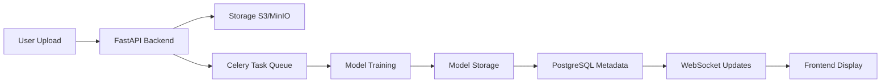

# 🤖 LLM-AutoML Platform - Next-Generation AI Development Platform

[](https://opensource.org/licenses/MIT)
[](https://www.python.org/downloads/)
[](https://nextjs.org/)
[](https://fastapi.tiangolo.com/)
[](https://www.docker.com/)
[](https://github.com/ngoubimaximillian12/LLM-Automl-Platform)

> **Democratizing AI** - A comprehensive, production-ready platform that enables anyone to build, deploy, and monetize machine learning models with **zero code** required.

[Quick Start](#-quick-start) • [Features](#-features) • [Documentation](./IMPLEMENTATION_ROADMAP.md) • [Roadmap](#-roadmap) • [Contributing](#-contributing)

---

## 🌟 What Makes This Platform Unique?

Unlike traditional AutoML tools, our platform combines cutting-edge AI with enterprise features:

| Feature | Status | Description |
|---------|--------|-------------|
| 🎨 **No-Code AI** | 🔨 Planned | Visual workflow builder for complete ML pipelines |
| 🧠 **Advanced AI** | ✅ Available | Computer Vision, NLP, Time Series, RL |
| 🔮 **Next-Gen** | 🔬 Research | Neurosymbolic AI, Quantum ML, Web3 |
| 🏪 **Marketplace** | 🔨 Planned | Buy, sell, and monetize AI models |
| 🔐 **Enterprise** | 🔨 Planned | Multi-user, teams, RBAC, SOC2 |
| 🚀 **Deploy Anywhere** | ✅ Available | API, Docker, K8s, Edge, Mobile |
| 🤝 **Collaborative** | 🔨 Planned | Real-time collaboration |
| 💰 **Monetizable** | 🔨 Planned | Built-in billing & subscriptions |

---

## 📋 Table of Contents

- [Features](#-features)
- [Quick Start](#-quick-start)
- [Architecture](#-architecture)
- [Technology Stack](#-technology-stack)
- [Use Cases](#-use-cases)
- [Roadmap](#-roadmap)
- [Documentation](#-documentation)
- [Contributing](#-contributing)
- [License](#-license)

---

## ✨ Features

### 🎯 Core ML Capabilities

<details>
<summary><b>AutoML & Algorithms</b> (Click to expand)</summary>

**AutoML Frameworks**:
- ✅ AutoGluon (Amazon - best performance)
- ✅ H2O.ai (enterprise-grade)
- ✅ FLAML (Microsoft - fast & lightweight)
- ✅ PyCaret (simple, powerful)
- ✅ TPOT (genetic programming)

**Supported Algorithms** (30+):
- **Classification**: Random Forest, XGBoost, LightGBM, CatBoost, Neural Networks, SVM, Logistic Regression
- **Regression**: Random Forest, XGBoost, Linear Regression, SVR, Neural Networks
- **Clustering**: K-Means, DBSCAN, Hierarchical
- **Dimensionality Reduction**: PCA, t-SNE, UMAP

</details>

<details>
<summary><b>Computer Vision</b> (Click to expand)</summary>

- 🖼️ **Image Classification**: ResNet, EfficientNet, Vision Transformers
- 🎯 **Object Detection**: YOLO v8, Faster R-CNN
- ✂️ **Image Segmentation**: SAM (Segment Anything), Mask R-CNN
- 👤 **Face Recognition**: FaceNet, ArcFace
- 📝 **OCR**: Tesseract, PaddleOCR, EasyOCR
- 🎨 **Image Generation**: Stable Diffusion integration
- 🎬 **Video Analysis**: Frame extraction, action recognition

</details>

<details>
<summary><b>Natural Language Processing</b> (Click to expand)</summary>

- 📊 **Text Classification**: BERT, DistilBERT, RoBERTa
- 😊 **Sentiment Analysis**: Fine-tuned transformers
- 🏷️ **Named Entity Recognition**: spaCy, Flair
- ❓ **Question Answering**: RoBERTa, ALBERT
- 📝 **Summarization**: T5, BART
- 🌐 **Translation**: MarianMT
- 💬 **Text Generation**: GPT-4, Claude integration
- 📚 **Topic Modeling**: LDA, BERTopic

</details>

<details>
<summary><b>Time Series & Forecasting</b> (Click to expand)</summary>

- 📈 **Univariate**: Prophet, ARIMA, SARIMA
- 📊 **Multivariate**: VAR, LSTM, GRU
- ⚠️ **Anomaly Detection**: Isolation Forest, LSTM Autoencoder
- 📉 **Decomposition**: Seasonal decomposition
- 🔮 **Advanced**: Temporal Fusion Transformer, NeuralProphet, TimeGPT

</details>

<details>
<summary><b>Other AI Capabilities</b> (Click to expand)</summary>

- 🎯 **Recommendation Systems**: Collaborative filtering, content-based, hybrid
- 🚨 **Anomaly Detection**: Isolation Forest, One-Class SVM, Autoencoders
- 🎮 **Reinforcement Learning**: PPO, A2C, SAC, DQN (Stable-Baselines3)
- 🕸️ **Graph Neural Networks**: PyTorch Geometric, DGL
- 🎵 **Audio Processing**: Speech recognition (Whisper), music classification

</details>

### 🎨 User Experience

- **Visual Workflow Builder** - Drag-and-drop ML pipeline creation (React Flow)
- **AI Copilot** - ChatGPT-style assistant for guidance and code generation
- **Real-time Collaboration** - Multiple users editing simultaneously (like Google Docs)
- **Interactive Dashboards** - Plotly/Recharts visualizations
- **Dark Mode** - Eye-friendly interface
- **Mobile Responsive** - Works on all devices
- **Command Palette** - Keyboard shortcuts (Cmd+K)

### 🚀 Deployment Options

Deploy your models anywhere:

```
┌─────────────────────────────────────┐
│  Deployment Targets                 │
├─────────────────────────────────────┤
│  ✅ REST API (FastAPI)              │
│  ✅ Docker Containers               │
│  ✅ Kubernetes (AWS EKS, GKE, AKS)  │
│  🔨 Edge Devices (Raspberry Pi)     │
│  🔨 Mobile (iOS, Android)           │
│  🔨 Browser (TensorFlow.js)         │
│  🔨 AWS SageMaker                   │
│  🔨 Google Vertex AI                │
│  🔨 Azure ML                        │
└─────────────────────────────────────┘
```

### 🏪 Model Marketplace (Planned)

- **Buy & Sell Models** - Monetize your trained models
- **NFT Integration** - Mint models as NFTs (Web3)
- **Revenue Sharing** - 80/20 split (creator/platform)
- **Ratings & Reviews** - Community-driven quality
- **Demo Capabilities** - Try before you buy

### 🔐 Enterprise Features (Planned)

- **Multi-User Authentication** - Email, Google, GitHub, Microsoft SSO
- **Team Collaboration** - Workspaces with role-based access (Owner, Admin, Member, Viewer)
- **API Keys** - Programmatic access with scoped permissions
- **Usage Tracking** - Detailed billing & analytics
- **White-Label** - Custom branding for enterprise
- **On-Premise Deployment** - Self-hosted option
- **Audit Logs** - Full compliance trail

### 🌟 Next-Generation AI

| Feature | Technology | Status |
|---------|------------|--------|
| **Neurosymbolic AI** | DeepProbLog, Neural-Symbolic | 🔬 Research |
| **Quantum ML** | PennyLane, Qiskit | 🔬 Research |
| **Federated Learning** | Flower framework | 🔨 Planned |
| **Synthetic Data** | CTGAN, StyleGAN | ✅ Available |
| **RAG Systems** | LangChain, LlamaIndex | ✅ Available |
| **Web3 Marketplace** | Ethereum, IPFS | 🔬 Research |
| **Homomorphic Encryption** | Microsoft SEAL | 🔬 Research |
| **Green AI Tracking** | CodeCarbon | 🔨 Planned |

---

## 🚀 Quick Start

### Prerequisites

- **Docker** & **Docker Compose** (recommended)
- **OR** Python 3.11+, Node.js 20+, PostgreSQL 15+, Redis 7+

### Option 1: Docker (Recommended) 🐳

```bash
# Clone the repository
git clone https://github.com/ngoubimaximillian12/LLM-Automl-Platform.git
cd LLM-Automl-Platform

# Copy environment variables
cp .env.example .env

# Edit .env and add your API keys
nano .env

# Start all services
docker-compose up --build

# Platform will be available at:
# Frontend: http://localhost:8501 (Streamlit)
# Backend API: http://localhost:8000
# API Docs: http://localhost:8000/docs
```

### Option 2: Manual Setup

<details>
<summary><b>Backend Setup</b> (Click to expand)</summary>

```bash
cd llm_automl_project/backend

# Create virtual environment
python -m venv venv
source venv/bin/activate  # On Windows: venv\Scripts\activate

# Install dependencies
pip install -r requirements.txt

# Start backend server
uvicorn app:app --reload --host 0.0.0.0 --port 8000
```

</details>

<details>
<summary><b>Frontend Setup</b> (Click to expand)</summary>

```bash
cd llm_automl_project/frontend

# Install dependencies (if any)
pip install -r requirements.txt

# Start frontend
streamlit run app.py --server.port 8501
```

</details>

### Create Your First Model

1. **Sign Up** - Visit `http://localhost:8501`
2. **Upload Dataset** - Navigate to Upload tab → Upload CSV
3. **Train Model** - Click "Train Model" → Select algorithm
4. **Monitor Training** - Watch real-time progress
5. **Evaluate** - View metrics, confusion matrix, ROC curve
6. **Deploy** - One-click API deployment

---

## 🏗️ Architecture

### System Architecture

```
┌─────────────────────────────────────────────────────────┐
│                    Load Balancer                        │
│                   (Nginx/CloudFront)                    │
└────────────────┬──────────────────┬─────────────────────┘
                 │                  │
    ┌────────────▼────────┐  ┌─────▼──────────────────┐
    │  Frontend           │  │  Backend (FastAPI)     │
    │  (Streamlit/Next.js)│  │  - SQLAlchemy          │
    │  - React 18         │  │  - Celery Workers      │
    │  - TypeScript       │  │  - WebSocket           │
    │  - Tailwind CSS     │  │                        │
    └─────────────────────┘  └────────┬───────────────┘
                                      │
              ┌───────────────────────┼──────────────────┐
              ▼                       ▼                  ▼
    ┌─────────────────┐    ┌──────────────┐   ┌──────────────┐
    │  PostgreSQL     │    │  Redis       │   │  MinIO/S3    │
    │  (Primary DB)   │    │  (Cache +    │   │  (Model      │
    │                 │    │   Queue)     │   │   Storage)   │
    └─────────────────┘    └──────────────┘   └──────────────┘
```

### Data Flow



---

## 💻 Technology Stack

### Frontend (Planned Migration to Next.js)

**Current** (v1.0):
```
- Streamlit (Python UI framework)
- Plotly (interactive charts)
- Pandas (data manipulation)
```

**Planned** (v2.0):
```javascript
- Next.js 14 (App Router)
- TypeScript
- Tailwind CSS + shadcn/ui
- Zustand (state management)
- React Query (data fetching)
- Socket.io (real-time)
- Recharts + Plotly (charts)
- React Flow (workflow builder)
```

### Backend

```python
Framework:     FastAPI
ORM:           SQLAlchemy 2.0
Migrations:    Alembic
Task Queue:    Celery
Validation:    Pydantic v2
Auth:          JWT + OAuth2
```

### AI/ML Stack

```python
AutoML:        AutoGluon, H2O.ai, FLAML, PyCaret
Deep Learning: PyTorch, TensorFlow/Keras
LLMs:          LangChain, LlamaIndex, Transformers
CV:            YOLO, SAM (Segment Anything), OpenCV
NLP:           Hugging Face Transformers, spaCy
Time Series:   Prophet, NeuralProphet, TimeGPT
RL:            Stable-Baselines3, Ray RLlib
Quantum:       PennyLane, Qiskit ML
```

### Infrastructure

```yaml
Database:      PostgreSQL 15
Cache:         Redis 7
Storage:       MinIO (S3-compatible)
Containers:    Docker + Docker Compose
Orchestration: Kubernetes (EKS, GKE, AKS)
CI/CD:         GitHub Actions
Monitoring:    Prometheus + Grafana
Logging:       Loki + Grafana
Tracing:       Jaeger
Errors:        Sentry
```

---

## 🎯 Use Cases

### 1. **E-Commerce & Retail**
- Customer churn prediction
- Product recommendations
- Demand forecasting
- Dynamic pricing
- Fraud detection

### 2. **Healthcare & Life Sciences**
- Disease diagnosis from medical images
- Patient readmission prediction
- Drug discovery & molecular design
- Clinical trial patient matching
- Medical report NLP

### 3. **Finance & Banking**
- Credit risk assessment
- Algorithmic trading strategies
- Fraud detection & prevention
- Market sentiment analysis
- Loan default prediction

### 4. **Marketing & Advertising**
- Customer segmentation
- Campaign optimization
- Sentiment analysis
- Lead scoring
- Churn prediction

### 5. **Manufacturing & Industry**
- Predictive maintenance
- Quality control & defect detection
- Supply chain optimization
- Anomaly detection in IoT sensors
- Production forecasting

### 6. **Media & Entertainment**
- Content recommendation
- Video content analysis
- Automated captioning
- Sentiment tracking
- Trend prediction

---

## 🗺️ Roadmap

### ✅ Completed (v1.0 - Current)
- [x] Basic AutoML with RandomForest
- [x] Dataset upload & EDA generation
- [x] Model training & evaluation
- [x] Email EDA reports (SMTP integration)
- [x] Streamlit UI with multiple tabs
- [x] Docker deployment
- [x] Basic bias auditing framework
- [x] LLM fallback (DeepSeek integration)
- [x] Feedback loop & auto-retraining

### 🚧 In Progress (v2.0 - Q1-Q2 2026)
- [ ] **Phase 1**: Foundation & Infrastructure
  - [ ] Next.js 14 frontend migration
  - [ ] Backend restructure (proper folder organization)
  - [ ] PostgreSQL setup with Alembic
  - [ ] Celery + Redis async tasks
  - [ ] MinIO/S3 storage integration
- [ ] **Phase 2**: Authentication & Multi-User
  - [ ] JWT + OAuth2 authentication
  - [ ] User registration & login
  - [ ] Team collaboration
  - [ ] Role-based access control (RBAC)
  - [ ] API key management
- [ ] **Phase 3**: Core AutoML Enhancement
  - [ ] AutoGluon integration
  - [ ] H2O.ai integration
  - [ ] Multiple algorithm support (30+)
  - [ ] Model versioning
  - [ ] Advanced EDA

### 📅 Planned (v3.0 - Q3-Q4 2026)
- [ ] **Phase 4**: Advanced AI Capabilities
  - [ ] Computer Vision suite (YOLO, SAM, OCR)
  - [ ] NLP capabilities (BERT, summarization, NER)
  - [ ] Time series forecasting (Prophet, LSTM)
  - [ ] Recommendation systems
  - [ ] Reinforcement learning
- [ ] **Phase 6**: UI/UX & Collaboration
  - [ ] Visual workflow builder (React Flow)
  - [ ] AI Copilot (ChatGPT-style assistant)
  - [ ] Real-time collaboration
  - [ ] Dark mode
  - [ ] Interactive dashboards
- [ ] **Phase 7**: Marketplace & Monetization
  - [ ] Model marketplace
  - [ ] Subscription tiers (Free, Pro, Enterprise)
  - [ ] Stripe integration
  - [ ] Usage-based billing
- [ ] **Phase 8**: MLOps & Deployment
  - [ ] Kubernetes deployment
  - [ ] Model serving (TorchServe, TF Serving)
  - [ ] Model monitoring & drift detection
  - [ ] CI/CD for ML
  - [ ] A/B testing framework

### 🔮 Future (v4.0+ - 2027+)
- [ ] **Phase 5**: Next-Gen Features
  - [ ] Neurosymbolic AI
  - [ ] Quantum ML (PennyLane, Qiskit)
  - [ ] Web3 & blockchain integration
  - [ ] Federated learning
  - [ ] Homomorphic encryption
- [ ] **Phase 9**: Mobile & Edge
  - [ ] React Native mobile apps
  - [ ] Edge deployment (Raspberry Pi, Jetson)
  - [ ] On-device training
  - [ ] IoT integration
- [ ] **Phase 10**: Integrations
  - [ ] Zapier, Make.com
  - [ ] Slack, Discord, Teams
  - [ ] Tableau, Power BI
  - [ ] AWS SageMaker, Vertex AI, Azure ML

**Detailed Roadmap**: See [IMPLEMENTATION_ROADMAP.md](./IMPLEMENTATION_ROADMAP.md) for complete 12-phase plan (68 weeks)

---

## 📚 Documentation

| Resource | Description |
|----------|-------------|
| [📋 Implementation Roadmap](./IMPLEMENTATION_ROADMAP.md) | Complete 12-phase implementation plan (100+ pages) |
| [🗄️ Database Schema](./DATABASE_SCHEMA.md) | Full PostgreSQL schema with 16 tables |
| [✅ Setup Complete](./SETUP_COMPLETE.md) | Quick reference for what's been created |
| [📝 Completed Tasks](./COMPLETED_TASKS.md) | Summary of accomplished work |
| [🔧 API Docs](http://localhost:8000/docs) | Interactive Swagger documentation (when running) |
| [👥 Contributing Guide](./CONTRIBUTING.md) | How to contribute to the project |

---

## 🧪 Testing

### Backend Tests
```bash
cd backend
pytest tests/ -v --cov=app --cov-report=html
```

### Frontend Tests
```bash
cd frontend
npm run test
npm run test:coverage
```

### E2E Tests
```bash
npm run test:e2e
```

### Load Testing
```bash
k6 run tests/load/api-test.js
```

**Test Coverage Goals**:
- Backend: 90%+
- Frontend: 80%+
- ML Pipelines: 85%+

---

## 🌐 Deployment

### Development
```bash
docker-compose up
```

### Staging
```bash
docker-compose -f docker-compose.staging.yml up -d
```

### Production (Kubernetes)
```bash
# Deploy to Kubernetes
kubectl apply -f kubernetes/

# Or use Helm
helm install llm-automl ./helm-chart
```

### Cloud Platforms
- **AWS**: ECS, EKS, SageMaker
- **Google Cloud**: GKE, Vertex AI
- **Azure**: AKS, Azure ML

---

## 🔒 Security

- **Authentication**: JWT tokens + OAuth2
- **Encryption**: AES-256 for data at rest, TLS 1.3 in transit
- **HTTPS**: Let's Encrypt SSL certificates
- **Rate Limiting**: Redis-based rate limiting (100 req/min)
- **Input Validation**: Comprehensive validation on all endpoints
- **SQL Injection**: Parameterized queries via SQLAlchemy
- **XSS Protection**: Content Security Policy (CSP)
- **CSRF Protection**: CSRF tokens
- **DDoS Protection**: Cloudflare

### Security Audits
- Monthly security scans with Snyk
- CodeQL analysis on every PR
- Trivy Docker image scanning
- TruffleHog secret detection

**Report vulnerabilities**: security@llm-automl.com

---

## 📊 Pricing (Planned)

| Plan | Price | Features |
|------|-------|----------|
| **Free** | $0/month | • 10 models/month<br>• 1GB storage<br>• Community support<br>• Basic algorithms |
| **Pro** | $29/month | • Unlimited models<br>• 100GB storage<br>• GPU training<br>• Email support<br>• Advanced algorithms |
| **Enterprise** | $299/month | • Everything in Pro<br>• Teams (unlimited members)<br>• White-label branding<br>• On-premise deployment<br>• Priority support<br>• SLA guarantees |

### Additional Revenue Streams
- **Model Marketplace**: 20% commission on sales
- **Pay-as-you-go**: Credits for compute/storage
- **Enterprise Contracts**: Custom pricing
- **Affiliate Program**: 20% commission

**Contact**: sales@llm-automl.com for Enterprise pricing

---

## 🤝 Contributing

We welcome contributions! Here's how you can help:

### Development Setup

```bash
# Fork the repo
git clone https://github.com/YOUR-USERNAME/LLM-Automl-Platform.git
cd LLM-Automl-Platform

# Create a branch
git checkout -b feature/amazing-feature

# Make changes and commit
git commit -m "feat: Add amazing feature"

# Push and create PR
git push origin feature/amazing-feature
```

### Code Style
- **Python**: Black formatter, PEP8, type hints with mypy
- **TypeScript**: Prettier, ESLint, strict mode
- **Commits**: [Conventional Commits](https://www.conventionalcommits.org/) format

### Pull Request Process
1. Update README.md with details of changes
2. Update IMPLEMENTATION_ROADMAP.md if needed
3. Add tests (maintain 90%+ coverage)
4. Ensure all CI checks pass
5. Request review from maintainers

See [CONTRIBUTING.md](./CONTRIBUTING.md) for detailed guidelines.

---

## 👥 Team

**Project Lead & Creator**

[Ngoubi Maximillian Diangha](https://github.com/ngoubimaximillian12)
- 📧 Email: ngoubimaximilliandiangha@gmail.com
- 🔗 LinkedIn: [Diangha Ngoubi](https://linkedin.com/in/diangha-ngoubi)
- 🐙 GitHub: [@ngoubimaximillian12](https://github.com/ngoubimaximillian12)

---

## 📄 License

This project is licensed under the **MIT License** - see the [LICENSE](LICENSE) file for details.

```
MIT License

Copyright (c) 2026 Ngoubi Maximillian Diangha

Permission is hereby granted, free of charge, to any person obtaining a copy
of this software and associated documentation files (the "Software"), to deal
in the Software without restriction, including without limitation the rights
to use, copy, modify, merge, publish, distribute, sublicense, and/or sell
copies of the Software, and to permit persons to whom the Software is
furnished to do so, subject to the following conditions:

The above copyright notice and this permission notice shall be included in all
copies or substantial portions of the Software.
```

---

## 🙏 Acknowledgments

This project builds upon amazing work from:

- **[AutoGluon](https://auto.gluon.ai/)** - Automated machine learning toolkit (Amazon)
- **[FastAPI](https://fastapi.tiangolo.com/)** - Modern Python web framework
- **[Next.js](https://nextjs.org/)** - React framework by Vercel
- **[Hugging Face](https://huggingface.co/)** - NLP models and datasets
- **[OpenAI](https://openai.com/)** - GPT models and API
- **[Anthropic](https://anthropic.com/)** - Claude AI
- **[shadcn/ui](https://ui.shadcn.com/)** - Beautiful UI components
- **[Streamlit](https://streamlit.io/)** - Python UI framework (current frontend)

Special thanks to the open-source community! 🎉

---

## 📈 Project Stats


---

## 💬 Community

Join our growing community:

- **Discord**: [Join our server](https://discord.gg/llm-automl) (Coming soon)
- **Twitter**: [@LLMAutoML](https://twitter.com/llm-automl) (Coming soon)
- **YouTube**: [Tutorial Videos](https://youtube.com/@llm-automl) (Coming soon)
- **Blog**: [blog.llm-automl.com](https://blog.llm-automl.com) (Coming soon)
- **GitHub Discussions**: [Discussions](https://github.com/ngoubimaximillian12/LLM-Automl-Platform/discussions)

---

## 📞 Support

Need help? We're here for you:

- **📖 Documentation**: [IMPLEMENTATION_ROADMAP.md](./IMPLEMENTATION_ROADMAP.md)
- **🐛 Report Bugs**: [GitHub Issues](https://github.com/ngoubimaximillian12/LLM-Automl-Platform/issues)
- **💡 Feature Requests**: [GitHub Issues](https://github.com/ngoubimaximillian12/LLM-Automl-Platform/issues)
- **💬 Discussions**: [GitHub Discussions](https://github.com/ngoubimaximillian12/LLM-Automl-Platform/discussions)
- **📧 Email**: support@llm-automl.com (Coming soon)

---

## 🌟 Star History

Help us grow by starring the repository! ⭐

[](https://star-history.com/#ngoubimaximillian12/LLM-Automl-Platform&Date)

---

## 🚀 Quick Links

- [🏠 Homepage](https://github.com/ngoubimaximillian12/LLM-Automl-Platform)
- [📋 Roadmap](./IMPLEMENTATION_ROADMAP.md)
- [🗄️ Database Schema](./DATABASE_SCHEMA.md)
- [🔧 API Docs](http://localhost:8000/docs)
- [👥 Contributors](https://github.com/ngoubimaximillian12/LLM-Automl-Platform/graphs/contributors)
- [📝 Changelog](./CHANGELOG.md) (Coming soon)
- [🔐 Security Policy](./SECURITY.md) (Coming soon)

---

<div align="center">

### Built with ❤️ for Ethical AI and Democratized Machine Learning

**Empowering everyone to harness the power of artificial intelligence**

[⬆ Back to top](#-llm-automl-platform---next-generation-ai-development-platform)

---

**© 2026 Ngoubi Maximillian Diangha. All rights reserved.**

</div>
